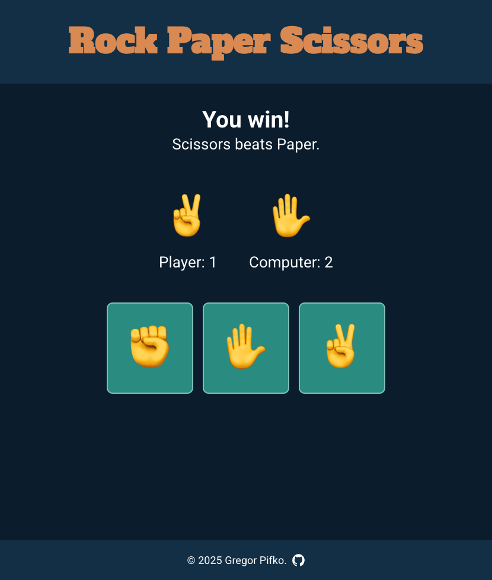

# Rock Paper Scissors

A web-based Rock, Paper, Scissors game built with TypeScript and Vite. Play against the computer and aim to be the first to score 5 points.

**[Play the game](https://jolbe.github.io/odin-project-rock-paper-scissors/)**

## Features

- Interactive web UI with emoji-based controls (✊ ✋ ✌️)
- Real-time score tracking
- Dark mode styling
- Responsive design

## Screenshot



## Getting Started

### Prerequisites

- Node.js and npm (or pnpm)

### Installation

```bash
npm install
```

### Development

```bash
npm run dev
```

### Build

```bash
npm run build
```

## Inspiration

UI design inspired by [michalosman.github.io/rock-paper-scissors](https://michalosman.github.io/rock-paper-scissors/) - a great reference for this project.

## About

This is an exercise from [The Odin Project](https://www.theodinproject.com/), adapted with a web UI implementation.

---

**Note:** This README.md was AI-generated. All other project code was written manually.
